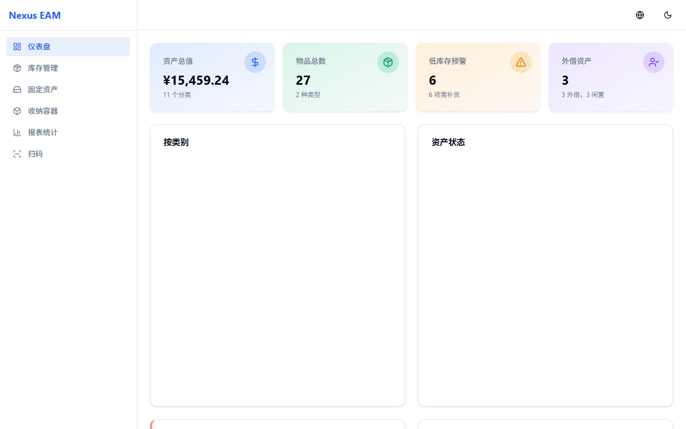
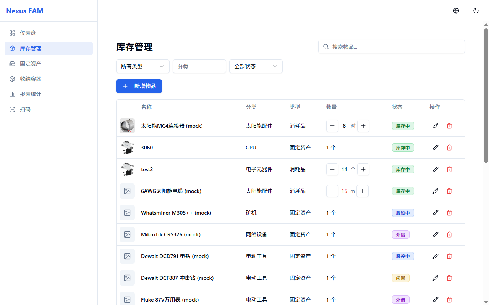
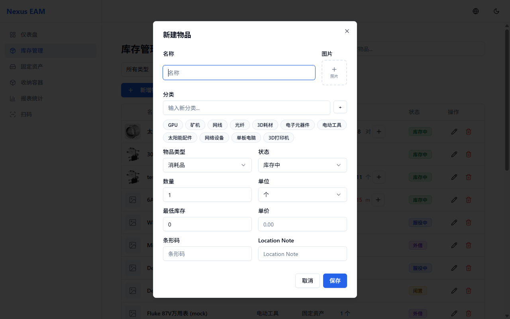
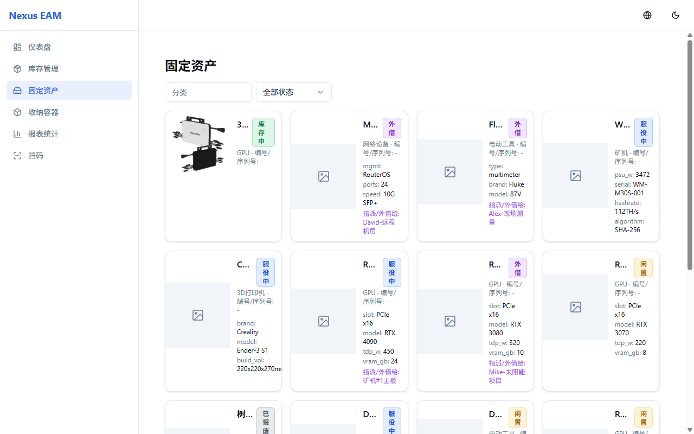
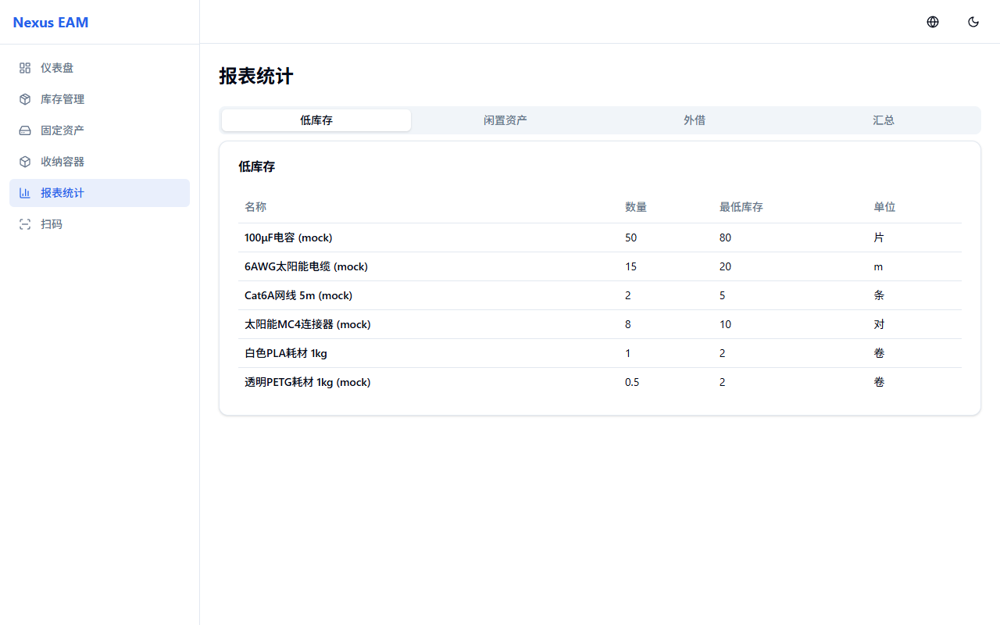

<p align="center">
  
</p>

<p align="center">
  <strong>Personal Hardcore Asset Management System</strong><br>
  <em>GPU, Miners, Solar Equipment, Consumables — All in One Place</em>
</p>

<p align="center">
  
  
  
  
  
  
</p>

---

## What is Nexus EAM?

Nexus EAM is a self-hosted, full-stack inventory and asset management system built for hardware enthusiasts, miners, and field operations teams. It tracks everything from high-value serialized equipment (GPUs, ASIC miners, network switches) to bulk consumables (cables, 3D printing filament, electronic components) — with QR code scanning, image uploads, and real-time low-stock alerts.

**Designed for deployment on Synology NAS via Docker Compose.**

---

## Screenshots

### Dashboard
Real-time overview with asset valuation, category distribution charts, status breakdown, low-stock alerts, and loaned/idle asset tracking.

<p align="center">
  
</p>

### Inventory Management
Full CRUD with image thumbnails, inline quantity adjustment (+/-), multi-filter search, tag-based category system, and pagination.

<p align="center">
  
</p>

### Add / Edit Item
Rich form dialog with image upload, persistent category tags, dynamic fields based on item type, barcode support.

<p align="center">
  
</p>

### Fixed Assets
Card-based view with image thumbnails, JSONB dynamic attributes, status badges, topology tree expansion, and loaned-to tracking.

<p align="center">
  
</p>

### Reports
Tabbed reports for low-stock alerts, idle assets, loaned equipment, and summary statistics.

<p align="center">
  
</p>

---

## Key Features

| Feature | Description |
|---------|-------------|
| **Dual-Track Inventory** | Serialized fixed assets (qty=1) + bulk consumables with min-stock alerts |
| **Image Management** | Upload photos per item, 40px thumbnails in lists, modal lightbox for full-size view |
| **Physical Topology** | Track "which GPU is in which rig" — recursive parent-child relationships via PostgreSQL CTE |
| **QR Code System** | Each container has a unique QR code. Scan with phone to view contents and adjust quantities |
| **Tag-Based Categories** | Persistent, user-defined category tags (stored in localStorage), one-click selection |
| **Quick Adjust** | Inline +/- buttons with optimistic UI updates and rollback on failure |
| **Multi-Language** | Chinese (zh) and English (en) with one-click toggle |
| **Dark Mode** | Full dark/light theme support |
| **JWT Auth** | Role-based access control (admin/operator/viewer) |
| **OpenAPI Ready** | Auto-generated Swagger docs at `/docs` — future AI agent integration ready |
| **Mobile-First Scan View** | Minimal, thumb-friendly interface at `/scan/:qrCodeId` — no navbar, large touch targets |

---

## Tech Stack

| Layer | Technology |
|-------|-----------|
| **Frontend** | React 19 + Vite + TypeScript + TailwindCSS + Shadcn UI + Zustand + Recharts |
| **Backend** | Python FastAPI + SQLAlchemy (async) + Pydantic v2 |
| **Database** | PostgreSQL 15 (JSONB attributes + recursive CTE topology) |
| **Cache** | Redis 7 |
| **Deployment** | Docker Compose (Synology NAS optimized) |

---

## Quick Start

### Prerequisites
- Docker & Docker Compose
- Git

### 1. Clone

```bash
git clone https://github.com/bkcsplayer/inventory-personal-helper.git
cd inventory-personal-helper
```

### 2. Configure

```bash
cp .env.example .env
# Edit .env — change POSTGRES_PASSWORD, SECRET_KEY, and CORS_ORIGINS
```

### 3. Run

```bash
# Production
docker compose up -d --build

# Development (with hot-reload)
docker compose -f docker-compose.dev.yml up -d --build
```

### 4. Access

| URL | Description |
|-----|-------------|
| `http://localhost:80` | Web UI (production) |
| `http://localhost:5173` | Web UI (development) |
| `http://localhost:8000/docs` | Swagger API docs |

**Default login:** `admin` / `admin123`

---

## Synology NAS Deployment

Full guide: [docs/synology-deploy.md](docs/synology-deploy.md)

**TL;DR:**
1. Upload project to NAS `/volume1/docker/nexus-eam/`
2. Create `.env` (set password, JWT secret, NAS IP)
3. Container Manager > Project > Create > select folder > Done
4. Access at `http://NAS-IP:8080`

---

## Project Structure

```
├── backend/
│   ├── app/
│   │   ├── api/v1/endpoints/    # REST endpoints (items, containers, auth, scan, reports, uploads)
│   │   ├── core/                # Config, database, security
│   │   ├── models/              # SQLAlchemy ORM (Item, Container, User)
│   │   ├── schemas/             # Pydantic request/response models
│   │   ├── services/            # Business logic (inventory, topology CTE, QR generation)
│   │   └── repositories/       # Database queries with filtering & pagination
│   └── Dockerfile.prod
├── frontend/
│   ├── src/
│   │   ├── components/          # Shadcn UI + custom (QuickAdjust, TopologyTree, ImageLightbox)
│   │   ├── pages/               # Dashboard, Inventory, Assets, Containers, Reports, ScanAction, Login
│   │   ├── services/            # Axios API clients
│   │   ├── stores/              # Zustand state management
│   │   └── i18n/                # EN/ZH translations
│   └── Dockerfile
├── database/init.sql            # Schema + seed data
├── docker-compose.yml           # Production
├── docker-compose.dev.yml       # Development
└── docs/
    ├── synology-deploy.md       # NAS deployment guide
    └── screenshots/
```

---

## API Highlights

```
POST   /api/v1/auth/login              # JWT authentication
GET    /api/v1/items?search=RTX&status=idle  # Filtered, paginated queries
POST   /api/v1/items/{id}/adjust       # Quick quantity adjustment (+/- delta)
PATCH  /api/v1/items/{id}/status       # Status change with assigned_to tracking
GET    /api/v1/topology/{id}           # Recursive device topology tree
GET    /api/v1/scan/{qr_code_id}       # Mobile scan lookup
POST   /api/v1/uploads/image/{id}      # Image upload
GET    /api/v1/reports/low-stock       # Low stock alerts
GET    /api/v1/reports/summary         # Asset valuation & category breakdown
```

Full interactive docs at `/docs` (Swagger UI).

---

## License

MIT

---

<p align="center">
  <sub>Built with FastAPI, React, and lots of GPU heat.</sub>
</p>
